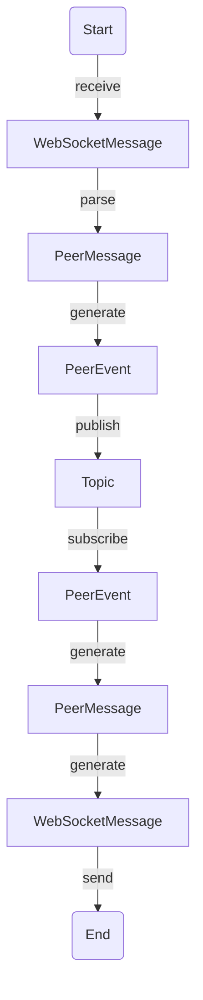

# Peers Server
## WebSocket
### Messages
#### Join message
```json
{
  "messageType": "JOIN",
  "groupId": "<UUID>",
  "groupRole": "<PEER|CLIENT|SERVER>"
}
```
```
<J><GROUP_BINARY_UUID><P|C|S>
```
#### Leave message
```json
{
  "messageType": "LEAVE",
  "groupId": "<UUID>"
}
```
```
<L><GROUP_BINARY_UUID>
```
#### Data message
```json
{
  "messageType": "DATA",
  "peerId": "<UUID>",
  "data": "<BASE64_DATA>"
}
```
```
<D><PEER_BINARY_UUID><BINARY_DATA>
```
#### Address List message
```json
{
  "messageType": "ADDRESS_LIST",
  "addresses": [
    {
      "type": "<LOCAL|PUBLIC>",
      "ip": "<IP>",
      "port": 0
    }
  ]
}
```
```text
<A>[<L|P><IPv6><PORT>&...]
```
